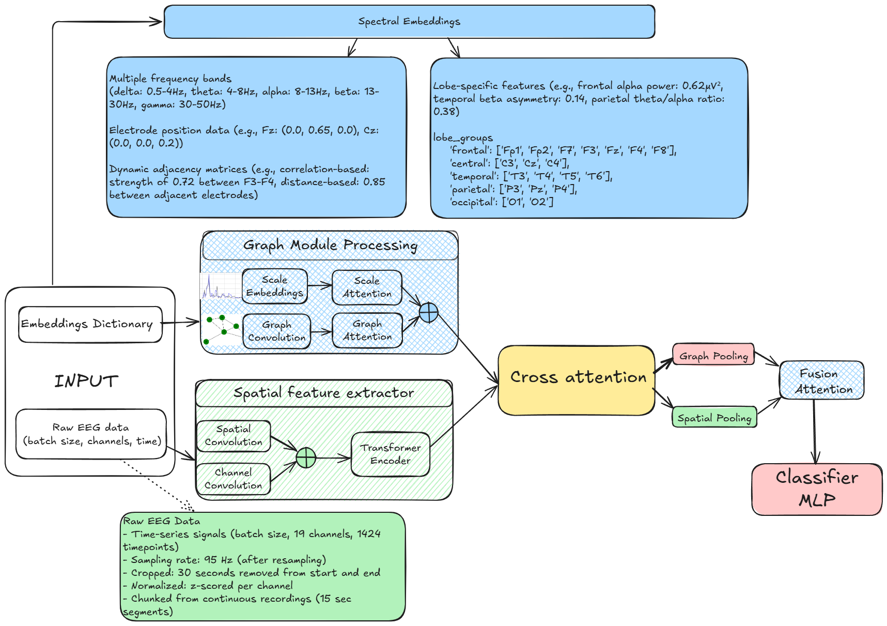

# EEG Classification with Multi-View Transformer and Graph Neural Networks

[]()


This repository contains code for advanced EEG signal analysis and classification using deep learning approaches that combine spatial, spectral, and temporal information.

## Project Overview

This project implements a novel neural network architecture for EEG classification that leverages both temporal dynamics and spatial relationships between electrodes. The model combines transformer-based approaches with graph neural networks to process EEG data in multiple domains simultaneously.

Key features:
- Multi-view transformer architecture for temporal processing
- Graph-based representation learning for electrode relationships
- Spectral analysis across multiple frequency bands (delta, theta, alpha, beta, gamma)
- Cross-attention mechanisms for information fusion
- Support for standard 10-20 EEG electrode system

## Performance Results

The table below shows the performance of different models on both within-subject and cross-subject test settings:

| Model                  | Test Setting    | Accuracy | AD vs. CN | FTD vs. CN | AD vs. FTD |
|------------------------|-----------------|----------|-----------|------------|------------|
| MVT                    | Within-Subject  | 89.83%   | 87.13%    | 93.94%     | 89.45%     |
| MVT                    | Cross-Subject   | 64.95%   | 70.61%    | 57.58%     | 65.90%     |
| MVTWavelet             | Within-Subject  | 90.69%   | 90.07%    | 91.41%     | 90.82%     |
| MVTWavelet             | Cross-Subject   | 63.80%   | 71.08%    | 55.41%     | 63.95%     |
| Multiscale GS (dim=128)| Within-Subject  | 97.38%   | 96.69%    | 96.97%     | 98.62%     |
| Multiscale GS (dim=128)| Cross-Subject   | 63.46%   | 71.08%    | 61.37%     | 56.18%     |
| Multiscale GS (dim=264)| Within-Subject  | **98.55%**| 98.53%    | 98.99%     | 98.17%     |
| Multiscale GS (dim=264)| Cross-Subject   | 59.68%   | 69.17%    | 55.23%     | 53.53%     |

The Multiscale Graph Spectral (GS) model with dimension 264 achieves the highest within-subject accuracy of 98.55%.

## Directory Structure

### Core Model Components
Each model follows a consistent naming pattern with dedicated files for model architecture, dataset handling, training, and testing:

#### Multiscale Graph Spectral (GS) Model
- `eeg_multi_scale_graph_spectral_advanced.py` - Main model architecture
- `eeg_dataset_multiscalegraph_spectral_advanced.py` - Dataset preprocessing
- `train_kfold_multi_scale_graph_spectral_advanced.py` - Training pipeline
- `test_multiscale_graph_spectral_advanced.py` - Evaluation script

#### Multi-View Transformer (MVT) Model
- `eeg_mvt.py` - Base MVT model architecture
- `eeg_mvt_dataset.py` - MVT dataset handling
- `train_kfold_mvt.py` - MVT training script
- `test_mvt.py` - MVT evaluation script

#### Multi-View Transformer with Wavelet Features
- `eeg_mvt_mfeat.py` - MVT model with wavelet features
- `eeg_mvt_dataset_mfeat.py` - MVT wavelet dataset handling
- `train_kfold_mvt_mfeat.py` - MVT wavelet training script
- `test_mvt_mfeat.py` - MVT wavelet evaluation script

#### Support Vector Machine (SVM)
- `eeg_svm.py` - SVM model implementation
- `eeg_svm_dataset.py` - SVM dataset handling
- `train_kfold_svm.py` / `train_kfold_svm_grid.py` - SVM training scripts
- `test_svm.py` - SVM evaluation script

#### EEGNet Model
- `eeg_net.py` - EEGNet model implementation
- `eeg_dataset.py` - Dataset preprocessing for EEGNet
- `train_kfold.py` - EEGNet training script
- `test.py` - EEGNet evaluation script

#### ADFormer Model
- `eeg_adformer.py` - ADFormer (Attention-based transformer) model
- `eeg_dataset_adformer.py` - ADFormer dataset handling
- `train_kfold_adformer.py` - ADFormer training script
- `test_adformer.py` - ADFormer evaluation script

### Data Processing and Analysis
- `data_prep.py` - Data preparation and splitting
- `data_vis.py` - Data visualization utilities
- `DataViz_EEG.ipynb` - Comprehensive EEG data visualization and analysis
- `MLP_KNN_EEG.ipynb` - MLP and KNN classifiers for baseline comparison 
- `Random_Forest.ipynb` - Random Forest classifier implementation

The Jupyter notebooks provide additional analysis techniques and classical machine learning approaches for comparison with the deep learning models. These notebooks offer interactive visualizations, feature importance analysis, and performance metrics for traditional classifiers.

### Utilities
- `hyperparameter_tuning.py` - Hyperparameter optimization
- `viz.py` - Visualization tools
- `model_architecture.py` - Model architecture utilities

## Model Architecture

The Multiscale Graph Spectral (GS) model architecture combines multiple neural network approaches:

1. **Spatial Feature Extractor**: Processes raw EEG signals using spatial and channel convolutions followed by transformer encoders
2. **Multi-Scale Graph Module**: Processes spectral embeddings at different frequency scales using graph convolutions and attention
3. **Cross-Attention Mechanism**: Fuses information between spatial and spectral pathways
4. **Pooling and Fusion**: Combines features from both pathways for final classification



### Component Diagrams
- [Spatial Extractor](spatial_extractor.png)
- [Multiscale Graph Module](multiscale_graph_module.png)
- [Cross Attention Interactive](cross_attention_interactive.html)

## Dataset Information

This project uses EEG data for classification between three groups:
- **A**: Alzheimer's Disease (AD) 
- **C**: Control (CN)
- **F**: Frontotemporal Dementia (FTD)

The data processing pipeline includes:
1. Cropping raw EEG data (removing 30 seconds from start and end)
2. Resampling to 95 Hz
3. Splitting into 15-second chunks (1424 timepoints)
4. Computing spectral features across multiple frequency bands
5. Creating adjacency matrices for electrode relationships
6. Calculating lobe-specific features for different brain regions

### Test Types

The models are evaluated on two different test scenarios:
- **Within-Subject**: Train and test data contain different chunks from the same subjects
- **Cross-Subject**: Train and test data contain completely different subjects

Cross-subject testing is significantly more challenging as it requires the model to generalize to unseen individuals, which explains the performance gap between the two test settings.

## Usage

### Data Preparation
```python
python data_prep.py
```

### Training
Choose the model you want to train:

```python
# Train the Multiscale Graph Spectral model
python train_kfold_multi_scale_graph_spectral_advanced.py

# Train the basic Multi-View Transformer
python train_kfold_mvt.py

# Train the Multi-View Transformer with wavelet features
python train_kfold_mvt_mfeat.py

# Train the SVM model
python train_kfold_svm.py
```

### Evaluation
```python
# Test the Multiscale Graph Spectral model
python test_multiscale_graph_spectral_advanced.py

# Test the Multi-View Transformer
python test_mvt.py

# Test the Multi-View Transformer with wavelet features
python test_mvt_mfeat.py
```

### Visualization
```python
python viz.py
```

## Requirements

- PyTorch
- MNE
- NumPy
- Scikit-learn
- Wandb (for experiment tracking)
- SciPy
## Using the Best Saved Model

The best performing model from our experiments is saved as `best_model_overall_multiscale_graph_spectral.pth`, which achieved **98.55%** accuracy on within-subject testing. To use this pre-trained model for inference:

1. Download the model file from the releases section or the models directory
2. Use the corresponding test script:

```python
# Test using the best Multiscale Graph Spectral model
python test_multiscale_graph_spectral_advanced.py --model_path "models/best_model_overall_multiscale_graph_spectral.pth" --device "cuda" --batch_size 16